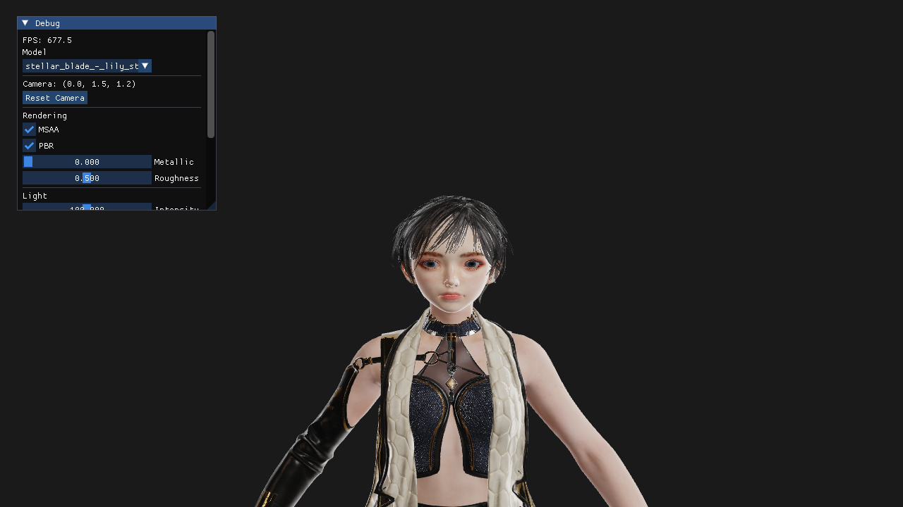

# Space — C++ OpenGL PBR Renderer

A real-time 3D rendering engine built with C++ and OpenGL, inspired by the architecture of [Three.js](https://threejs.org/).



## Features

### Rendering
- **PBR** — Cook-Torrance BRDF (GGX NDF, Smith Geometry, Schlick Fresnel)
- **IBL** — Image-Based Lighting with HDR environment map (diffuse irradiance + specular split-sum)
- **ACESFilmic Tone Mapping** — filmic contrast, no blown-out highlights
- **Normal Mapping** — tangent-space TBN with Gram-Schmidt re-orthogonalization
- **MSAA** — multi-sample anti-aliasing via offscreen FBO resolve
- **Alpha Blending** — two-pass opaque + transparent with correct depth write handling

### glTF 2.0 Support
- **Native GLTFLoader** — parses glTF/GLB directly without Assimp (spec-compliant)
- **KHR_materials_clearcoat** — dual-layer specular (hair, car paint, coated surfaces)
- **KHR_materials_specular** — Fresnel F0 tint and intensity override
- **Full PBR material** — albedo, metallic-roughness, normal, occlusion, emissive textures
- **Alpha modes** — OPAQUE / MASK / BLEND per material
- **Double-sided** geometry support

### Architecture
- **IRenderer** abstract interface — OpenGL backend today, Vulkan-ready tomorrow
- **Scene graph** — `Object3D` / `MeshObject` / `SceneObject` hierarchy
- **GLTFLoader** — pimpl pattern hides `nlohmann/json`; direct GPU texture IDs
- **GLIBL** — precomputes irradiance cubemap (32px), prefiltered env map (128px, 5 mips), BRDF LUT (512px) on GPU

### Developer Tools
- **ImGui debug panel** — model selector, PBR sliders, light position/intensity, IBL intensity, fullscreen toggle
- **Headless screenshot** — `--screenshot [path]` saves PNG via `glReadPixels`, no display required

## Project Structure

```
src/
├── core/         # Object3D, MeshObject, SceneObject, Camera, Geometry, Material
├── renders/      # GLRenderer, GLProgram, GLTexture, GLBindingState, GLIBL, GLFramebuffer
├── loaders/      # GLTFLoader (native glTF 2.0), ObjLoader (Assimp)
└── errors/       # OpenGL error helpers
shaders/
├── pbr_shader.{vs,fs}              # Main PBR + IBL shader
├── equirect_to_cubemap.{vs,fs}     # HDR equirectangular → cubemap
├── irradiance_convolution.{vs,fs}  # Diffuse IBL precomputation
├── prefilter.{vs,fs}               # Specular IBL precomputation
└── brdf_lut.{vs,fs}                # Smith GGX BRDF LUT
assets/
├── env/neutral.hdr                 # Studio HDR environment map
└── lily/                           # Stellar Blade - Lily GLB model
deps/
├── glad/          # OpenGL loader
├── glm/           # Math library
├── imgui/         # Dear ImGui
├── nlohmann/      # JSON parser (for GLTFLoader)
└── stab/          # stb_image + stb_image_write
```

## Requirements

- macOS (Apple Silicon / Intel)
- CMake ≥ 3.5
- C++17

```bash
brew install cmake glog assimp sdl2
```

## Build & Run

```bash
git clone https://github.com/lele94218/space.git
cd space
cmake . -DCMAKE_POLICY_VERSION_MINIMUM=3.5
make -j4
./main
```

### Headless screenshot (no display needed)

```bash
./main --screenshot output.png
```

## Controls

| Input | Action |
|-------|--------|
| Mouse drag | Orbit camera |
| Scroll | Zoom |
| F | Toggle fullscreen |
| Q / ESC | Quit |

## Roadmap

- [ ] Skeletal animation (glTF skins + AnimationMixer)
- [ ] Shadow mapping
- [ ] Skybox (render IBL env as background)
- [ ] Skin subsurface scattering (SSS)
- [ ] Morph targets (blend shapes / facial animation)
- [ ] Post-processing (Bloom, SSAO, DoF)
- [ ] Multiple light sources

## Commit History

| Commit | Feature |
|--------|---------|
| `a7770d1` | IRenderer abstract interface |
| `34b65f3` | Normal mapping (TBN) |
| `5af61c3` | PBR (Cook-Torrance BRDF) |
| `354d0ae` | Native GLTFLoader |
| `ba52477` | Fullscreen, Lily auto-load, PBR defaults |
| `917903f` | Camera/light defaults |
| `6a36649` | KHR clearcoat/specular, headless screenshot |
| `e8d47cb` | IBL, ACESFilmic, hair depth fix, color correction |
